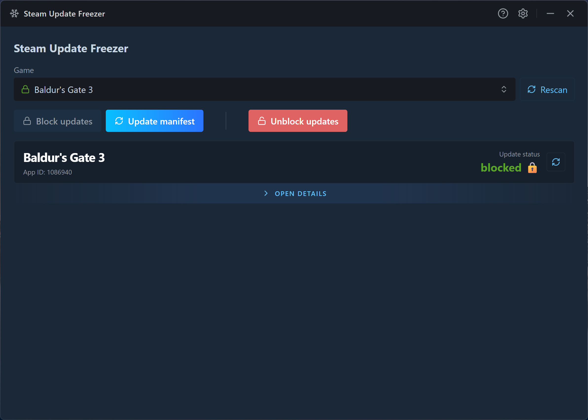

<div align="center">

# ❄️ Steam Update Freezer

*A simple, easy-to-use Windows utility to freeze your Steam game versions and prevent forced updates.*

<br />

[](../../releases)
[](../../releases/latest)
[](./LICENSE)

<br />



</div>

## Goal

Steam does not allow you to easily disable game updates. The official options—like *"Let Steam decide when to update"* or *"Wait until I launch the game"*—still force the patch before you can actually play.

For many players, this is incredibly frustrating:
- **Broken Mods:** Uncontrolled updates can instantly break heavily modded setups (like in Skyrim, Fallout, Cyberpunk, or Stalker).
- **Predictable Experience:** Sometimes you just want a stable, predictable gaming experience without worrying that a sudden patch will ruin your save files or introduce new bugs.

**Steam Update Freezer** solves this by safely tricking Steam. It modifies your local game manifest (`.acf` file) to match the latest public build data, and then locks it. Steam thinks the game is fully up-to-date, allowing you to launch your stable, modded game normally while staying completely online.

## Features

- **Simple & Focused:** No background services. Click **Block updates** to freeze a game, and when a patch drops later, **Update manifest** convinces Steam the download is already done — so your game stays exactly where you left it.
- **Auto-Detects Your Library:** Scans every Steam library folder across all your drives and lists your installed games automatically — no hunting for App IDs or install paths.
- **Branch-Aware (Beta-Friendly):** Reads the branch each game is actually installed on and freezes against the matching **public *or* beta** build, so a beta install is never accidentally desynced to the public version.
- **Fail-Safe & Reversible:** Every freeze first backs up your original game state, so one click always restores it — no reinstalls, no manual file edits.
- **No Admin Rights Required:** Runs entirely under your normal user account — Steam's default install path is user-writable, so there's no UAC prompt and no elevation.
- **Safe by Default:** State-changing actions are gated behind confirmation dialogs out of the box, and blocked while Steam is running. Tune or disable the prompts anytime in **Settings**.

## Requirements

- **Windows 10 or 11** (64-bit).
- **The Steam desktop client**, installed with at least one game already downloaded.

## How to Use / Installation

### Installation
1. Go to the [Releases](../../releases) page on GitHub.
2. Download the latest `SteamUpdateFreezer-Setup.exe`.
3. Run the installer. It uses a one-click installation process — it automatically installs to your user directory (`AppData\Local`) and launches immediately.

> [!NOTE]
> Because this app is open-source and not signed with a (costly) commercial certificate, **Windows SmartScreen** may show a *"Windows protected your PC"* warning the first time you run the installer. This is expected for indie apps. To continue, click **More info** → **Run anyway**. This is a one-time prompt — once installed, the app launches normally with no further warnings.

### How to Use

> [!IMPORTANT]
> **Always close Steam completely** before using this utility — a running Steam can revert your manifest changes on exit. As a safeguard, the app blocks all actions while it detects Steam running (check the system tray).

1. **Close Steam.** Ensure it is not running in the system tray.
2. **Open Steam Update Freezer.** It will automatically detect your Steam libraries and games.
3. **Select your game** from the list.
4. **Click "Block updates".** Your game is now safely frozen. You can launch Steam and play your game normally while staying online.
5. **When a patch drops later:** Close Steam again, open the app, and click **"Update manifest"**. This syncs your local file with the latest Steam data, tricking Steam into thinking the update is already installed.

## FAQ

**Q: Can my Steam account get banned or flagged by anti-cheat systems (VAC, EAC, BattlEye)?**  
**A:** No. This utility only edits plain text configuration files (`.acf` manifests) in your Steam directory to pause downloads. It does not inject into game memory, modify game or Steam executables, or interfere with any anti-cheat systems.

**Q: Does this work for online multiplayer games?**  
**A:** Generally, no. Most online games require your client to strictly match the server version. If the server updates while your game is frozen, you will get a "Version Mismatch" error. This tool is designed for modded single-player or private co-op games.

## Disclaimer & Known Limitations

This utility relies on a workaround that is not officially supported by Valve. Please keep the following in mind:

- **Do NOT verify game files:** Never click "Verify integrity of game files..." in Steam on a frozen game. Steam will compare your older files against the faked, up-to-date manifest, realize they don't match, and immediately force a download.
- **Unofficial Workaround:** Because this relies on manipulating local `.acf` file states, it is theoretically possible that future updates to the Steam client architecture could affect this utility's functionality.

*This project is an independent, open-source community tool. It is not affiliated with, endorsed by, or in any way officially connected to Valve Corporation or Steam.*

*This utility is provided "as is". It is designed to be safe and creates automatic backups, but please use it responsibly.*

## Privacy & Analytics

This app uses strictly anonymous analytics to help me understand whether it's being used and working correctly. You can turn it off anytime in **Settings → Privacy & Analytics** — full details in the [Privacy Policy](./PRIVACY.md).

## Development

This project is built with **Electron Forge** (Webpack + TypeScript), **React 19**, and **Tailwind CSS v4**.

### Prerequisites
- [Node.js](https://nodejs.org/) **v24.12.0** (pinned in `.nvmrc` — run `nvm use`; other versions are rejected by `engine-strict`)
- [pnpm](https://pnpm.io/) package manager

### Commands

```bash
# Clone the repository
git clone https://github.com/mysteriousdev777/steam-update-freezer.git
cd steam-update-freezer

# Install dependencies
pnpm install

# Start the dev server (with hot-reloading for the renderer)
pnpm start

# Build the distributable (.exe)
pnpm run make
```

## Issues & Feedback

If you encounter a bug or have a suggestion, feel free to open an issue. Since this is a highly focused personal utility, I am not actively looking for large feature contributions or pull requests, but bug reports and feedback are appreciated.
