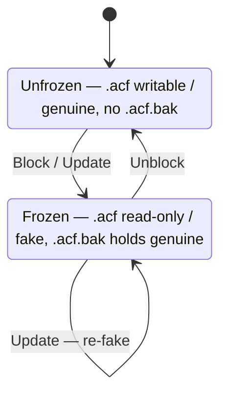
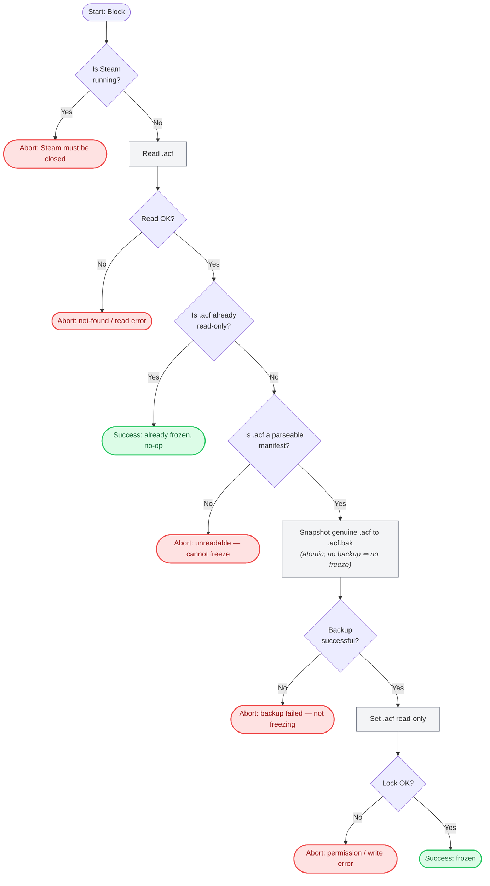
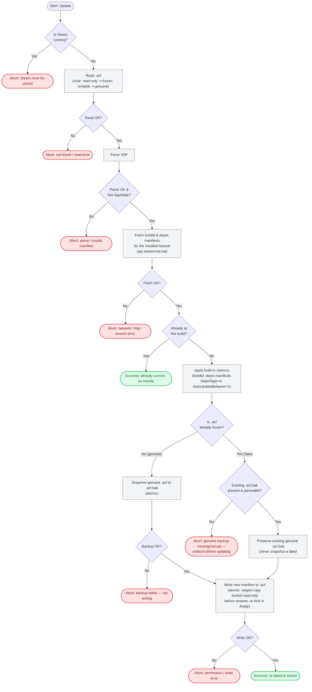
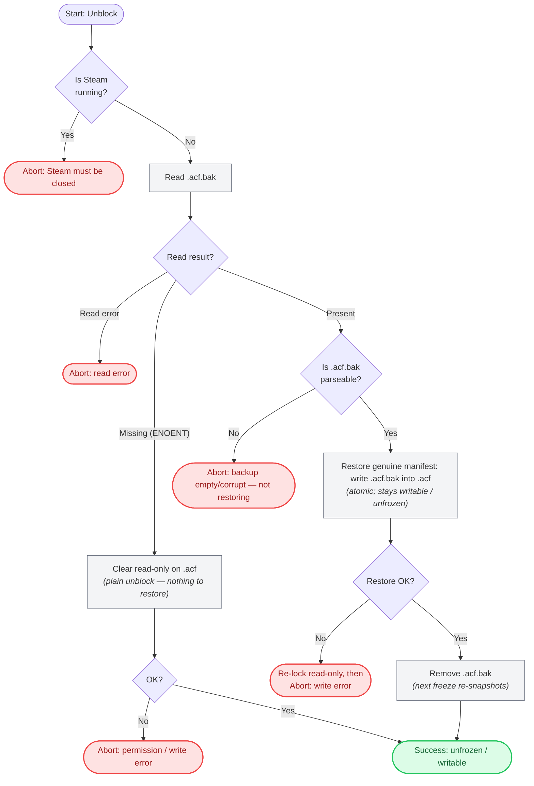

# Application Flows

This document visualizes the safety-critical logic the app enforces when it edits a game's
Steam `appmanifest_<APPID>.acf`. It has two layers:

- a **state model** — the legal states of the `.acf` on disk and the actions that move
  between them (the mental model + the core invariant), and
- three **per-action flowcharts** — the guards and abort paths inside each action (Block,
  Update, Unblock).

**Source of truth.** [`src/main/services/freezer.ts`](../src/main/services/freezer.ts) is
authoritative for *behavior*; these diagrams are derived from it. The *Domain safety rules* in
[`AGENTS.md`](../AGENTS.md) hold the *why* (invariants and rationale, not captured here). These
diagrams show safety-relevant branches, not every line of code.

## Conventions

- **Precondition (all mutating actions):** Steam must be **fully closed**. Steam holds the
  `.acf` in memory and rewrites it on exit, so any edit while it runs would be clobbered.
- **State vocabulary** (used consistently below):
  - _writable / genuine_ — the `.acf` is the real installed version (unfrozen).
  - _read-only / fake_ — the `.acf` has been rewritten to pin a build and locked (frozen).
  - _`.acf.bak`_ — the snapshot of the **genuine** manifest; a frozen `.acf` always has one.
- **Core invariant:** _frozen ⇒ a genuine `.acf.bak` exists._ Both freeze paths (Block and
  Update) establish it; every writer refuses to snapshot a `.bak` from a frozen (possibly fake)
  `.acf`.
- **Node colors:** gray = action/step, green = success (incl. no-op), red = abort.

## `.acf` state model

On the freeze edge, **Block** locks the current build as-is while **Update** also re-stamps the
manifest to the branch's latest build — both snapshot the genuine manifest, then lock. State-preserving
no-ops are omitted here and live in the flowcharts: **Block** on an already-frozen game does nothing,
and an **Update** already at the current build makes no change.

## Block updates (freeze)

Snapshot the genuine manifest to `.acf.bak`, then lock the `.acf` read-only. Backup **before**
lock — no backup, no freeze. Bails idempotently if the `.acf` is already read-only, so it never
snapshots a fake over the genuine backup.

## Update manifest

Rewrite the `.acf` so Steam treats the install as current at the installed branch's latest
build. Must handle both genuine and already-frozen manifests while **strictly preserving the
genuine `.acf.bak`**: snapshot only a genuine (writable) manifest; when already frozen, keep the
existing backup and refuse if it's missing or corrupt.

## Unblock updates (restore)

Restore the genuine manifest from `.acf.bak`, clear read-only, then drop the backup so the next
freeze re-snapshots afresh. Restoring the true installed version is what lets SteamPipe compute a
correct delta on the next update; a corrupt/empty backup aborts rather than overwriting the live
manifest with garbage.

